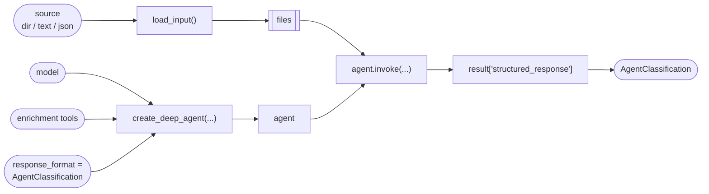

# agent-classifier

A **Classifier agent** that analyses *other* AI agents and returns a structured
classification of them: goals, domain, category, capabilities, autonomy level, data
sensitivity, and risks — all validated against a fixed schema.

It is built on [DeepAgents](https://github.com/langchain-ai/deepagents) (the LangChain
agent harness). The agent under analysis is loaded onto the deep agent's virtual
filesystem; the classifier reads the artifacts, looks up what referenced MCP servers and
skills actually do, and emits the schema via DeepAgents' `response_format`.

## How it works



1. **`inputs.py`** normalises whatever you have — a directory of agent files, a single
   text blob, or a structured dict — into the DeepAgents virtual filesystem.
2. **`agent.py`** builds one deep agent with the built-in filesystem tools (`ls`,
   `read_file`, `grep`, …), the enrichment tools, and
   `response_format=AgentClassification`.
3. The agent reads everything, optionally calls `lookup_mcp_server` / `lookup_skill` to
   understand referenced components, then returns the schema.

## Install

Requires **Python 3.13+**.

```bash
python -m venv .venv && source .venv/bin/activate
pip install -e .            # add ".[dev]" for the test dependencies
cp .env.example .env        # then fill in your ANTHROPIC_API_KEY
```

## Usage

Library:

```python
from agent_classifier import classify

result = classify("./path/to/agent")     # dir, file path, text blob, or dict
print(result.overall_risk, result.domain)
print(result.model_dump_json(indent=2))
```

CLI:

```bash
agent-classifier ./path/to/agent            # classify a directory
agent-classifier agent.md -o result.json    # classify a file, write JSON
cat instructions.md | agent-classifier -    # classify text from stdin
agent-classifier ./agent --no-enrichment    # skip the lookup tools
```

## Output schema

`AgentClassification` (see `schema.py`) contains: `title`, `summary`, `domain`,
`subdomains`, `category`, `goals[]`, `capabilities[]`, `autonomy_level`,
`data_sensitivity`, `risks[]`, `overall_risk`, `confidence`, and `missing_info`. Every
goal and risk carries an `evidence` field to keep the output grounded, and
`missing_info` captures what the input didn't reveal instead of guessing.

## Configuring it

- **Taxonomy** — the allowed `domain`, `category`, and risk categories live in
  `taxonomy.py`. Edit those enums to reshape the classification; the schema and prompt
  follow automatically.
- **Model** — set `AGENT_CLASSIFIER_MODEL` (any
  [`init_chat_model`](https://python.langchain.com/docs/how_to/chat_models_universal_init/)
  id, e.g. `anthropic:claude-opus-4-8` for depth, `openai:gpt-5.5`, or a local `ollama:`
  model) and `AGENT_CLASSIFIER_TEMPERATURE`. Defaults to `anthropic:claude-sonnet-4-6`
  at temperature 0.
- **Enrichment** — `tools.py` holds a small offline knowledge base of common MCP
  servers. Extend `_MCP_KB`, or swap `lookup_mcp_server` for a live registry /
  web-search lookup; the agent wiring is indifferent to the implementation.

## Testing

```bash
pytest                 # offline: schema, taxonomy, input adapters, agent wiring
python tests/eval.py   # end-to-end eval on the sample agent (needs an API key)
```

The offline suite runs without credentials — `test_agent_build.py` compiles the full
deep agent (no network call happens until `invoke`). `tests/eval.py` makes real model
calls and checks soft expectations against `tests/fixtures/sample_agent`.

## Code quality

All quality tools are wired through **pre-commit** and mirrored in CI
(`.github/workflows/quality.yml`) and **nox**. Set up the git hook once:

```bash
pip install -e ".[dev]"
pre-commit install          # run the checks on every commit
pre-commit run --all-files  # or run them on demand
nox                         # or run the full suite in isolated envs
```

One convention spans every tool: **88-column line length** (Black's default, Python's
own PEP 8 79/80 columns stretched slightly for modern screens), applied to Python
(ruff/black/isort/flake8) and to Markdown prose (mdformat/pymarkdown) alike — see
`line-length = 88` / `line_length: 88` in `pyproject.toml` / `.pymarkdown.json`.

The stack, and who owns what:

<!--- pyml disable md013 --->

| Concern     | Tools                                                                                                                            |
| ----------- | -------------------------------------------------------------------------------------------------------------------------------- |
| Format      | **ruff format** (the formatter) + **isort** (`profile = black`); **black --check** verifies ruff's output stays black-compatible |
| Lint        | **ruff** and **flake8** (both lint; ruff's `I` rules are off so isort owns imports)                                              |
| Types       | **mypy** (`strict`, scoped to `src`); the package ships a `py.typed` marker                                                      |
| Security    | **bandit** + ruff's `S` rules (code) · **pip-audit** (dependency CVEs) · **detect-secrets** (secret scanning)                    |
| Deps & docs | **deptry** (unused/missing deps) · **interrogate** (100% coverage) · **pydocstyle** (conventions) · **codespell** (typos)        |
| Markdown    | **mdformat** (the formatter, `--number` keeps real list ordinals) · **pymarkdown** (structure) · **proselint** (prose quality)   |
| Tests       | **pytest** + **pytest-cov** (coverage gate: 90%) + **hypothesis** (property-based)                                               |

<!--- pyml enable md013 --->

CI (`.github/workflows/quality.yml`) runs the whole thing on a **Python 3.13 & 3.14
matrix**, and **Dependabot** keeps dependencies and Actions up to date. Configuration
for most tools lives in `pyproject.toml`; pymarkdown (`.pymarkdown.json`) and proselint
(`.proselintrc.json`) use their own config files since neither reads `pyproject.toml`.
The pre-commit hooks run the versions pinned in the `[dev]` extra so local, hook, and CI
runs match.

Markdown files (this README, the prompt files, fixtures) are linted like code:
`mdformat` wraps prose to 88 columns (`--wrap 88`, matching the Python line length) and
rewrites formatting; `pymarkdown` checks structure at the same 88-column limit
(headings, fenced code, duplicates) — `first-line-heading` is off because `prompts/*.md`
are model input, not standalone documents, and fenced code / the one comparison table
above are exempted from the length check since wrapping either would break them (code
can't be rewrapped, and a wrapped table loses its alignment — the table above is
deliberately wrapped in `<!--- pyml disable/enable md013 --->` markers rather than
silently excluded project-wide). `proselint` flags weasel words, clichés, and redundancy
(its typography and lexical-illusions checks are off; both mostly fire on code spans,
fences, and the Mermaid diagram above rather than on actual prose).

## Extending to specialist sub-agents

For deeper, auditable analysis you can promote the single agent to an orchestrator with
one sub-agent per dimension (goal-analyst, risk-assessor, domain-classifier), each
returning a partial result. That's a change isolated to `build_agent` in `agent.py` (add
`subagents=[...]`); the `classify()` contract and the output schema stay the same.
